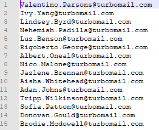
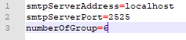
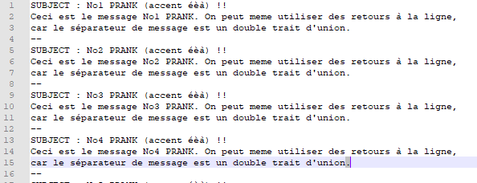

# Teaching-HEIGVD-RES-2021-Labo-SMTP

## Labo 04 RES
Le 02.05.2021 \
Auteurs : Allemano Enzo, Zacheo Luca

## Description
Le but du logiciel développé est d'envoyer des mails forgés en grande quantité ainsi que de manière automatisée.
Pour ce faire nous avons une liste d'emails ainsi qu'une liste de Pranks (étant les messages envoyés).

A l'exécution du programme nous pouvons choisir le nombre de personnes qui seront affectées par nos Pranks (taille du groupe)
ainsi que le nombre de groupes.

Le programme se connecte en localhost sur le port 25, nous utilisons un serveur MockMock pour simuler le serveur SMTP.

## Instruction d'installation / utilisation
<h4> Démarrage du SRV </h4>

* Télécharger la release
* Décompresser le zip
* Démarrer Docker
* Aller dans le dir docker et lancez respectivement `build-image.sh` ainsi que `run-container.sh`
* vérifier le bon lancement du srv en tappant `localhost:8282` dans un navigateur.

<h4> Remplissage des fichiers de configs </h4>

* Aller dans le dir "config"
* Remplir le fichier `victims.utf8` avec les emails des futurs victimes

 
* Configurer le fichier `config.properties` comme l'image ci-dessous

 

Ce fichier sert à gérer le port ainsi que l'adresse à laquelle notre application tentera de se connecter.

Mais il sert également à définir le nombre de groupes de victimes.

* Remplir le fichier `messages.utf8` avec les messages de futurs faux e-mails.

Comme mentionné dans l'images ci-dessus,
il faut respecté la nomenclature du sujet en laissant le `SUBJECT : ` 

Il faut donc écrire le sujet souhaité à la suite de ce mot avec un espace et terminer le sujet par un `!!`

Le séparateur entre les messages est un double trait d'union (--).

<h4> Lancement de l'application </h4>

* Retourner au dossier racine
* Lancer la commande `java -jar Teaching-HEIGVD-RES-2021-Labo-SMTP-1.0-SNAPSHOT.jar`
* Constater le résultat sur le serveur MockMock

## Choix d'implémentation

